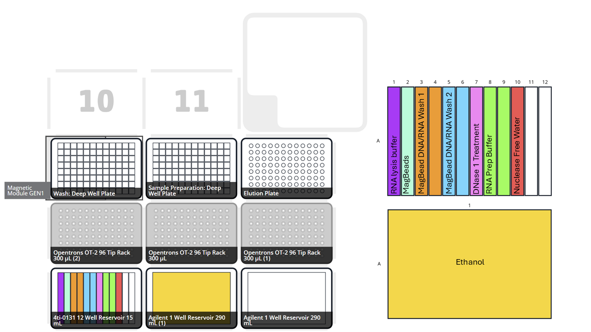

# Quick-RNA™ MagBead - Customisable Opentrons script for RNA purification protocol for up to 48 samples

### Authors: Aryaan Kumar - Credit to users: kll24-rgb, Geljul, and juliaperrinos for contributing to base protocol without customisability

## Introduction
This is an automated [Zymo protocol for RNA purification](https://files.zymoresearch.com/protocols/_r2132_r2133_quick-rna_magbead.pdf).
- Custom Sample Protocol :  RNA purification for any number of samples up to 48 using 8-channel pipette, compatible with older Opentrons APIs without partial tip commands.

## Contents of file
- Code_Custom_Tips_RNA_Purification.py            - Zymo protocol handling any number of samples up to 48.
- Pseudocode_Custom_Tips_RNA_Purification.py      - pseudocode for Code_Custom_Tips_RNA_Purification.py
- Simulation_Custom_Tips_RNA_Purification.py      - simulation of Code_Custom_Tips_RNA_Purification.py

Note that the simulation code has already been set with original labware names in order to simulate the protocols, but still require a user input for number of samples and elution volume.

 
## RNA Purification Overview

### Code Setup
To tailor the protocol to your experiment define number of samples and elution volume in the user input section at the beginning of the code.

### Deck set up

### Sample Setup
- 200uL sample should be loaded into each well of the 96 well plate by column (i.e. fill column A from the top, then B etc.) to a max of 48 samples.
- The user will then edit the protocol file with the number of samples and final elution volume which can be done in notepad.
- Tips used for transferring reagents will be returned to the tip box in slot 5 for reuse in future runs of this protocol - remember to discard if fresh tips are needed.

### Reservoir Setup
Solutions required per sample:
- 200 ul RNA Lysis Buffer
- 500 ul RNA Prep Buffer
- 30 ul MagBinding Beads
- 50 ul or more RNase-Free Water
- 50 ul DNase I Reaction Mix
- 500 ul MagBead DNA/RNA Wash 1 (concentrate)
- 500 ul MagBead DNA/RNA Wash 2 (concentrate)
- 900 ul Ethanol

- Fill the multi-well reservoir (slot 1) from left to right - for reagents using two wells add a little over 12mL maximum to each well - the code will switch wells after 12mL has been transferred.

## Future Work
- Streamline Custom Sample Protocol code to improve readability for users with custom sample numbers
- Create GUI interface to allow easy input of sample numbers
